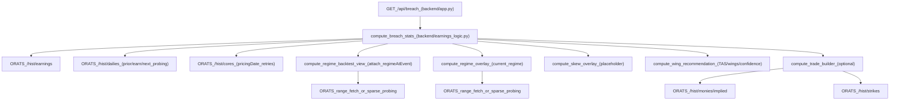
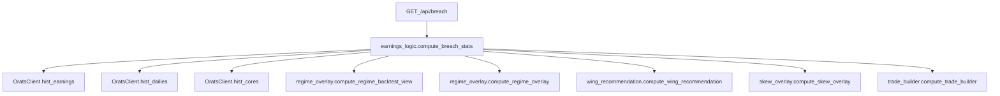

# Production Quant/Eng Audit — ORATS Earnings Implied Move Breach Tool

Date: 2025-12-15  
Reviewer: senior quant / quant engineer (production focus)

## Executive Summary

This repo is a **single-endpoint FastAPI service** with a **plain JS frontend**. The core analytics live in one “god function” (`compute_breach_stats`) that performs event normalization, breach/seasonality stats, and then calls overlays (regime + skew) and an optional trade builder.

The largest loss risks are concentrated in **event-time alignment**, **small-sample uncertainty**, **definition drift** (k-consistency), and **strike-selection safety**. The current code already has good bones (caching, retries, no-lookahead test for regime), but it needs **explicit telemetry, estimator hardening, and regression fixtures** to prevent future drift.

---

## Phase 0 — Architecture Map

### Backend: file list + responsibilities

- `backend/app.py`
  - **FastAPI app** with routes:
    - `GET /` → serves `static/index.html`
    - `GET /api/health` → health check
    - `GET /api/breach` → main API
  - **Singleton** ORATS client (`OratsClient.from_env()`).
  - **Response caching** for `/api/breach` (TTLCache, 6h) keyed by `(ticker,n,years,k)`.
  - Special behavior: when response is cached, it **refreshes `current` snapshot** to reduce UI staleness.

- `backend/orats_client.py`
  - ORATS v2 **HTTP client**:
    - Session with urllib3 `Retry` (5 total; backoff; retries on 429/5xx).
    - Manual extra 429 backoff if no `Retry-After`.
    - In-memory response cache (TTLCache, 6h, maxsize 10k).
  - Normalizes ORATS responses into `OratsResponse(rows=[...])`.
  - Treats certain **404s as empty rows** for probing (dailies/cores/monies/strikes).
  - Endpoint wrappers used by the app:
    - `/hist/earnings`, `/hist/cores`, `/hist/dailies`
    - `/hist/strikes` (trade builder)
    - `/hist/monies/implied` (trade builder + skew scaffolding)

- `backend/earnings_logic.py`
  - **Primary business logic** (`compute_breach_stats`):
    - Pulls earnings history (`hist/earnings`), filters by lookback, selects last `n`.
    - Classifies timing (`AMC/BMO/UNK`) from `anncTod`.
    - Computes **pricingDateUsed** + realized window (close→open) based on timing.
    - Pulls implied move from cores (`impErnMv`) with backoff for missing dates.
    - Pulls realized move using dailies (prior/earn/next probing).
    - Computes breach, “above breach”, ratios, directional breach + overshoot, quarter seasonality, heuristics.
    - Calls overlays:
      - `compute_regime_backtest_view` (attaches `regimeAtEvent` to events)
      - `compute_regime_overlay` (current regime summary + guidance)
      - `compute_skew_overlay` (degraded scaffolding)
    - Calls `compute_wing_recommendation` and optionally `compute_trade_builder`.
  - Also exposes `compute_current_snapshot` used by `backend/app.py`.

- `backend/regime_overlay.py`
  - Regime computation:
    - **Current regime** (`compute_regime_overlay`) based on:
      - SPY RV20 percentile (market stress proxy)
      - SPY abs 5D move percentile (correlation proxy)
      - single-name IV percentile (from cores: tries `iv30`, `iv30d`, `iv30Day`, `iv`)
    - Maps to `tailMultiplier` (clamped 0.7–2.0), label, and trade gate.
  - **Backtest view** (`compute_regime_backtest_view`):
    - Computes `regimeAtEvent` **as-of `pricingDateUsed`** using trailing windows only (explicit no-lookahead intent).
    - Produces `regimeValidation` rollup: breach rates by gate, flagged vs missed, etc.
  - Has its own caches (2h for current, 24h per as-of date).

- `backend/skew_overlay.py`
  - Skew overlay:
    - Computes a “skew snapshot” via a placeholder mapping from `/hist/monies/implied` vols.
    - Degrades safely to `skewQuality="MISSING"` with notes if endpoint assumptions are wrong.
    - Attaches snapshots keyed by `pricingDateUsed` (intended no-lookahead).
  - Cached (6h, maxsize 50k).

- `backend/wing_recommendation.py`
  - Computes **TAS** (Tail Asymmetry Score) in [-1, +1] from:
    - directional breach-rate asymmetry and overshoot asymmetry (history component)
    - regime “amplifier” component
    - (optional) skew component (currently `None` in main pipeline)
  - Derives wing multipliers (base * tailMultiplier, plus capped asymmetry) and confidence.

- `backend/trade_builder.py`
  - Uses `/hist/monies/implied` to choose expiration near a DTE target.
  - Uses `/hist/strikes` to pick short strikes by delta or premium; chooses long strikes by width.
  - Returns either chain-based strike selection or a “distance target only” fallback in UI (frontend supports both).

- `backend/__init__.py`
  - package marker.

### Frontend: entry + rendering + response parsing

- `static/index.html`
  - Single page UI. Calls `/api/breach` with `ticker,n,years,k` plus optional trade builder params.
  - Displays summary metrics, quarter seasonality cards, regime overlay, regime validation, skew/wings section, and earnings table.

- `static/app.js`
  - Fetch wrapper + rendering functions.
  - Maintains UI state (expanded earnings, advanced columns, trade builder controls).
  - Parses JSON response and expects stable fields like:
    - `summary.*`, `baseline.*`, `quarters.Q1..Q4.*`, `events[]`, `regime.*`, `regimeValidation.*`, `wingRecommendation.*`, `skewOverlay.*`, optional `tradeBuilder`.
  - Contains some duplicated logic (e.g., wing factor mapping) that mirrors backend.

---

## Call Graph Summary (backend)

---

## Coupling + Maintainability Hotspots

### Excessive coupling

- **`backend/earnings_logic.py` is a god module**:
  - owns business definitions (breach/overshoot/near-breach/seasonality),
  - owns event-time normalization,
  - coordinates overlays and trade-building,
  - implicitly defines what the frontend displays and what downstream “decisioning” uses.

### Redundant logic / drift risk

- Duplicated helpers across modules:
  - `_to_float`, `_imp_to_pct` exist in multiple modules (`earnings_logic.py`, `trade_builder.py`, `orats_client.py` has its own float parsing in skew scaffolding).
- Duplicated business mappings across backend+frontend:
  - quarter→base wing factor (`Tight/Standard/Wide`) exists in JS and Python.
- Multiple “heuristic constants” embedded in code rather than config:
  - tail-bias thresholds, confidence cutoffs, k handling, etc.

### Determinism / reproducibility

- `compute_breach_stats(..., today=...)` is used in tests, but **event filtering cutoff uses `dt.date.today()`**, which can create time-dependent behavior in future tests or scripted runs.

---

## Phase 1 — Quant Findings (10+ concrete issues / improvements)

Severity scale: **High / Med / Low**. “Why it matters” is framed in trading risk terms (IC sellers around earnings).

1) **k-inconsistent overshoot definition** *(High)*  
   - **Observed**: breach threshold uses \(k \times implied\), but `aboveBreachPct` uses \((realized-implied)/implied\) regardless of k.  
   - **Why it matters**: if traders toggle k to 1.5/2.0, “overshoot severity” becomes **mis-calibrated**, pushing wrong wing sizing and false comfort.

2) **Implied move unit normalization is fragile around sub-1% moves** *(High)*  
   - **Observed**: `_imp_to_pct` treats values `<= 1.0` as decimals (0.045→4.5%). If ORATS ever emits “percent units” below 1.0 (0.8 meaning 0.8%), it will be interpreted as 80%.  
   - **Why it matters**: implied move scale errors cause **order-of-magnitude width mistakes** (catastrophic trade sizing).

3) **“Nearest trading day” probing has hidden data-integrity risk** *(High)*  
   - **Observed**: realized window uses “nearest trading day within 10 steps” and accepts any bar with open/close available. There is no telemetry on how often windows are shifted.  
   - **Why it matters**: subtle window shifts bias realized moves lower/higher and can materially distort breach stats, especially in names with data gaps/corporate actions. Without telemetry you can’t diagnose bad names.

4) **`anncTod` classification heuristics are time-zone / format brittle** *(Med/High)*  
   - **Observed**: parses strings containing “AMC/BMO/AFTER/BEFORE” and numeric times; assumes 4pm / 9:30 cutoffs.  
   - **Why it matters**: timing misclassification directly flips which close/open you use → **systematic under/overstatement** of realized earnings moves.

5) **Directional breach rates are computed vs all usable events (not conditional on direction)** *(Med)*  
   - **Observed**: `upBreachRatePct = upBreaches / events_used`, `downBreachRatePct = downBreaches / events_used`.  
   - **Why it matters**: mixing directional breach with unconditional denominator can understate tail-direction signal; if used for asymmetry, it can mute or distort tail bias.

6) **Means on overshoot are outlier-sensitive** *(Med)*  
   - **Observed**: overshoot aggregates are simple means. Earnings tails are heavy-tailed; 1–2 extreme events dominate.  
   - **Why it matters**: leads to unstable sizing (“whipped around”) and can overreact right before the next large loss.

7) **Seasonality z-score is not robust and can mislead** *(Med)*  
   - **Observed**: `z_breach` uses baseline p0 and quarter p with normal approximation; no multiple-testing correction, no shrinkage, and small n gating is minimal.  
   - **Why it matters**: quarter labels can appear significant when they’re not, biasing tactical decisions.

8) **Regime proxy choices are plausible but coarse** *(Med)*  
   - **Observed**: SPY RV20 percentile + SPY abs 5D move percentile + single-name IV percentile. Correlation proxy is not a correlation measure; single-name IV field selection is heuristic.  
   - **Why it matters**: gating can be noisy; over-gating misses edge, under-gating misses stress regime risk.

9) **Regime tailMultiplier mapping is heuristic and uncalibrated** *(Med)*  
   - **Observed**: `tailMultiplier = clamp(0.7, 2.0, 0.8 + 1.2*regimeScore)`.  
   - **Why it matters**: in stress, a mis-calibrated multiplier can produce **too-tight wings** or false confidence.

10) **WingRecommendation confidence is currently mostly sample-size based** *(Med)*  
   - **Observed**: confidence HIGH never occurs without skew; MED only if events_used >= 12.  
   - **Why it matters**: confidence should reflect **uncertainty** (CI width) not only n; otherwise you can still over-size on unstable stats.

11) **Trade builder can select pathological shorts under equal-premium** *(High)*  
   - **Observed**: nearest premium selection may choose near-ATM/ITM in some chains; no OTM safety constraints.  
   - **Why it matters**: direct “one trade blows up” risk: wrong payoff, assignment risk, and tail exposure.

12) **Caching does not include methodological flags (future drift risk)** *(Med)*  
   - **Observed**: `/api/breach` cache key ignores any future estimation-mode flags; mixing cached results across methods is a subtle production bug.  
   - **Why it matters**: stealth regime change in outputs → traders lose trust and/or take wrong risk.

---

## Phase 2 — Upgrade Roadmap (prioritized)

### Quick wins (1–2 hours each)

1) **Add per-event telemetry for window shifts**  
   - **Change**: add `pricingDateShiftDays` and `realizedWindowShiftDays` + rollups.\n   - **Acceptance**: telemetry present; strict mode unchanged by default; tests cover shift calculations.\n\n2) **k-consistent overshoot fields (additive)**\n   - **Change**: add `...VsK` fields consistent with \(k\).\n   - **Acceptance**: existing fields unchanged; new fields correct; tests for k=1 and k>1.\n\n3) **Trade-builder OTM guardrails (flagged)**\n   - **Change**: enforce short put < spot, short call > spot (and optional delta bounds).\n   - **Acceptance**: new tests show pathological case fixed; API unchanged.\n\n4) **Determinism fix for `today` injection**\n   - **Change**: ensure event filtering and “current quarter” logic use `today` when provided.\n   - **Acceptance**: tests stable across calendar time.\n\n### Medium upgrades (half-day)\n\n5) **Uncertainty-aware decisioning (Beta posterior / Wilson)**\n   - **Change**: keep raw rates for display; add `breachProb_mean_beta` + CI90 for decisioning; map confidence to n + CI width.\n   - **Acceptance**: new outputs behind flags; deterministic tests; confidence no longer “blows up” at small n.\n\n### Big upgrades (multi-day)\n\n6) **Calibrate regime/tailMultiplier + gating**\n   - **Change**: calibrate mapping on historical SPX/SPY regimes; add validation metrics (precision/recall for breach prediction).\n   - **Acceptance**: measurable improvement in out-of-sample breach detection.\n\n7) **Proper skew surface integration + chain selection**\n   - **Change**: replace placeholder skew mapping with true delta-slice vols (if endpoint available) and more robust DTE/expiry selection.\n   - **Acceptance**: skew feature stability; improves asymmetry sizing without lookahead.\n\n8) **Probabilistic earnings move model**\n   - **Change**: model distribution of earnings move conditional on regime/sector/event type; output predictive intervals.\n   - **Acceptance**: improved calibration and risk sizing; documented assumptions.\n\n---\n\n## Phase 3 — Implementation Plan (what will be changed)\n\nThe implementation will follow the attached plan (telemetry + k-consistency + Beta posterior + trade-builder guardrails + golden fixtures) using **default-OFF flags** where needed and **additive-only API changes**.\n*** End Patch}"}}
## Architecture Map (current state)

### Backend entrypoints
- **`backend/app.py`**
  - **FastAPI routes**:
    - `GET /` serves `static/index.html`
    - `GET /api/health`
    - `GET /api/breach` main endpoint
  - **Caching**:
    - Singleton `OratsClient` (`_get_client()`)
    - Response cache for `/api/breach` keyed by `(ticker,n,years,k)` with TTL 6h
    - Special behavior: even when cached, it **refreshes `current` snapshot** via `compute_current_snapshot()` to reduce stale “assumed price / EM” in UI.

### Core computation + dataflow
- **`backend/earnings_logic.py`** (center of gravity)
  - **Responsibility**: end-to-end computation for `/api/breach`:
    1. Fetch earnings events (`client.hist_earnings`)
    2. **Normalize event timing** (AMC/BMO/UNK via `classify_timing(anncTod)`)
    3. **Find trading-day bars** around event (`hist/dailies` probing)
    4. Fetch implied earnings move (`hist/cores` impErnMv) on a “pricing date”
    5. Compute realized move from close→open window
    6. Compute breach/near-breach/overshoot + quarter seasonality + directional tail stats
    7. Compute overlays:
       - Regime overlay + backtest view (`backend/regime_overlay.py`)
       - Skew overlay (`backend/skew_overlay.py`)
       - Wing recommendation / TAS (`backend/wing_recommendation.py`)
    8. Optional trade builder (`backend/trade_builder.py`) when extra params present
  - **Coupling**: heavy. This module owns **math**, **ORATS calling strategy**, **data integrity**, **UX-oriented fields**, and **decision outputs** in one place.

### ORATS client + caching/retries
- **`backend/orats_client.py`**
  - **Responsibility**: normalized GET wrapper for ORATS v2 endpoints
  - **Caching**: `TTLCache` keyed by (method, path, sorted params excluding token)
  - **Retries**:
    - urllib3 `Retry(total=5, status_forcelist={429,5xx})`
    - extra manual backoff on 429 (even if no Retry-After)
  - **Behavioral assumption**: treat 404 from selected hist endpoints as “empty rows” to support trading-day probing.

### Regime overlay + validation
- **`backend/regime_overlay.py`**
  - **`compute_regime_overlay()`**: “current regime” using SPY trailing RV20 percentile, SPY abs 5D move percentile, and single-name IV percentile, mapped to `tailMultiplier` and `tradeGate`.
  - **`compute_regime_backtest_view()`**:
    - Computes `regimeAtEvent` **as-of `pricingDateUsed`** (intended no-lookahead).
    - Produces `regimeValidation` rollups (breaches flagged vs missed by gate).
  - **Caching**:
    - current overlay cached 2h (per ticker/n/years/k)
    - per-date `regime_asof` cached 24h (ticker, as_of_date)

### Skew overlay (scaffold / degraded)
- **`backend/skew_overlay.py`**
  - Uses `OratsClient.get_skew_by_delta()` which currently maps `hist/monies/implied` fields (`vol10/25/50/75/90`) into rough delta-slice vols.
  - Degrades safely: returns `skewQuality="MISSING"` if unavailable.
  - Uses **`pricingDateUsed`** for event-time snapshots (no lookahead if `pricingDateUsed` is correct).

### Wing recommendation / TAS
- **`backend/wing_recommendation.py`**
  - Computes TAS from:
    - directional breach-rate asymmetry and overshoot asymmetry (history component)
    - small regime amplification (regime component)
    - optional skew component (currently `None` by default)
  - Emits:
    - `structureMode` (equal-delta vs equal-premium heuristic)
    - wing multipliers (base, put, call)
    - `confidence` (currently mostly sample-size based)

### Trade builder (chain-based strikes)
- **`backend/trade_builder.py`**
  - Picks an expiration near target DTE using `hist/monies/implied`
  - Selects strikes using `hist/strikes` based on either:
    - equal-delta (target delta) or
    - equal-premium (target mid premium)
  - Constructs long wings by fixed `$ wing_width` and nearest strikes
  - Returns a safe stub payload when chain is missing.

### Frontend entry + rendering
- **`static/index.html`**
  - Single-page tool: ticker input + breach multiple dropdown + “Calculate”
  - Renders sections: Summary, Regime, Skew & Wings, Quarter Seasonality, Earnings Events
- **`static/app.js`**
  - Calls `GET /api/breach?ticker=...&n=20&years=5&k=...`
  - Parses response keys like `summary.breach_rate_pct`, `quarters[Qx].seasonality`, `regime.guidance.tradeGate`, `events[].pricingDateUsed`, `wingRecommendation.*`
  - UI logic includes “Buffer Target” calculation (explicitly UI-only).

### Call graph summary (route → core)

## Data integrity + design hotspots (where coupling is excessive)

- **`backend/earnings_logic.py` is a “god module”**:
  - It mixes:
    - event-time alignment (critical to correctness)
    - estimator definitions (breach, overshoot, near-breach)
    - UI payload shaping
    - decision heuristics (recommendation labels)
    - overlay orchestration (regime/skew)
    - optional chain builder
  - Result: high blast radius for changes and drift risk across definitions.

- **Definition drift risk**:
  - Breach is parameterized by request `k`, but some downstream quantities are implicitly “k=1 flavored” (details in Quant Findings).

- **Hidden substitutions**:
  - Trading-day probing and cores retries can shift dates; the current payload doesn’t surface how often that happens, which is a major production observability gap.

## Quant Findings (issues + improvements)

Each item includes severity and why it matters **in trading terms** (tail risk, bias, instability).

1) **Overshoot definition is inconsistent with breach threshold when `k != 1`** *(High)*
   - **What**: breach uses \( |move| > k \cdot implied \) but `aboveBreachPct` is computed as \((realized - implied)/implied\) (per spec and current code).
   - **Why it matters**: traders will interpret overshoot as “how far beyond my threshold,” but for `k>1` it overstates tail severity, biasing wing sizing and confidence.
   - **Fix**: add **k-consistent overshoot** fields (additive) defined vs \(k \cdot implied\).

2) **Small samples can create false certainty (confidence and TAS sizing)** *(High)*
   - **What**: `wingRecommendation.confidence` is essentially LOW unless `events_used >= 12`; there’s no uncertainty quantification on breach rates/overshoots.
   - **Why it matters**: short vol strategies die from “few data points + a narrative.” You end up oversizing asymmetry on noise.
   - **Fix**: add Wilson/Beta uncertainty; map confidence to CI width + n (flag-gated).

3) **Date substitution is invisible (both realized window and implied pricing date)** *(High)*
   - **What**: trading-day probing and cores date retries can shift dates by multiple calendar days; payload does not quantify it.
   - **Why it matters**: systematic substitutions (illiquid names, corporate actions, data gaps) can silently bias breach stats and make comparisons across tickers invalid.
   - **Fix**: always add telemetry fields: `realizedWindowShiftDays`, `pricingDateShiftDays` + rollups.

4) **Cores retry steps by calendar day (not trading-day aware)** *(Med)*
   - **What**: implied move retry decrements date by 1 day up to 5 attempts; weekends/holidays are handled via 404→empty but it’s still a blunt instrument.
   - **Why it matters**: can drift implied move to an earlier regime/vol state, especially around holidays, slightly biasing implied estimates.
   - **Fix**: keep behavior for compatibility; add shift telemetry and optionally strict mode.

5) **Trading-day probing returns a bar if either open or close exists** *(Med)*
   - **What**: `find_trading_day()` considers a day “found” if `clsPx` OR `open` exists.
   - **Why it matters**: for BMO you need prior close; returning a day with only open can mis-set `pricingDateUsed` while still leaving close missing (event becomes unusable, but telemetry is currently absent).
   - **Fix**: stricter probing per field in strict mode; telemetry always.

6) **AMC/BMO classification heuristic has edge cases** *(Med)*
   - **What**: `classify_timing()` uses substring matching and a numeric HHMM heuristic with hard-coded cutoffs (>=16:00 AMC, <=9:30 BMO).
   - **Why it matters**: misclassifying timing shifts the realized window by ~1 day, which can materially change realized move and breach label.
   - **Fix**: keep heuristic; add event notes + telemetry; consider a whitelist of known ORATS anncTod codes if available.

7) **Unknown timing events are excluded → selection bias** *(Med)*
   - **What**: UNK timing is excluded from breach stats.
   - **Why it matters**: if UNK is non-random (certain tickers/cycles), you bias your sample and breach estimates.
   - **Fix**: keep exclusion (safer) but surface `% excluded` and timing breakdown prominently (telemetry/quality).

8) **Mean-based overshoot is outlier-sensitive** *(Med)*
   - **What**: overshoot averages use mean; one outlier quarter dominates.
   - **Why it matters**: tail sizing can be whipped by a single event (exactly the failure mode for short ICs).
   - **Fix (roadmap)**: median/MAD or trimmed mean (flag-gated) + bootstrap stability.

9) **Regime score weights and proxies are heuristic and uncalibrated** *(Med)*
   - **What**: regimeScore = 0.50*SPY_RV20_pct + 0.35*ticker_IV_pct + 0.15*SPY_abs5d_pct; tailMultiplier mapping is linear then clamped.
   - **Why it matters**: can gate trades incorrectly (false NO_TRADE in benign markets or vice versa) and distort wing sizing.
   - **Fix (roadmap)**: calibrate on breach outcomes; test alternative proxies (e.g., SPY IV percentile if available via cores/monies) while keeping endpoints feasible.

10) **Percentile rank definition is inclusive and can saturate** *(Low/Med)*
   - **What**: percentile is `count(v<=x)/N`. Max is always 1.0.
   - **Why it matters**: regimeScore can be more “sticky” near extremes; may exaggerate stress.
   - **Fix (roadmap)**: use mid-rank or ECDF with (rank-0.5)/N.

11) **Trade builder can select strikes that violate trader intent (OTM constraints missing)** *(High)*
   - **What**: selection doesn’t enforce short put < spot and short call > spot.
   - **Why it matters**: one bad chain selection can convert a “defined-risk IC” into an unintended risk profile (assignment/ITM exposure).
   - **Fix**: optional OTM enforcement + sanity notes (flag-gated).

12) **Cache keys don’t account for methodology flags** *(High once flags exist)*
   - **What**: `/api/breach` cache is keyed only by `(ticker,n,years,k)`; if you add alternative estimators behind flags and don’t include flags in keys, you can mix outputs.
   - **Why it matters**: nondeterminism + “ghost bugs” in production; traders will see numbers change without changing inputs.
   - **Fix**: include enabled-flag state (and prior params) in cache keys.

## Roadmap (prioritized)

### Quick wins (1–2 hours each)
1) **Telemetry for substitutions (always-on additive)**
   - **Change**: add per-event `realizedWindowShiftDays`, `pricingDateShiftDays` and summary rollups.
   - **Compatibility**: additive only.
   - **Acceptance**: any shifted window is visible; can quantify “data-gap reliance.”

2) **k-consistent overshoot fields**
   - **Change**: add overshoot vs threshold fields defined vs \(k \cdot implied\).
   - **Compatibility**: keep `aboveBreachPct` unchanged; add new fields.
   - **Acceptance**: for `k=2`, overshoot vs k differs from legacy, correctly.

3) **Trade builder OTM constraints**
   - **Change**: filter strike candidates so shorts are OTM; fail safe with notes if not possible.
   - **Compatibility**: flag-gated, default OFF.
   - **Acceptance**: chain selection never returns ITM shorts when enabled.

### Medium upgrades (half-day)
4) **Uncertainty-aware breach probabilities**
   - **Change**: add Beta posterior mean + 90% CI outputs; optionally map confidence to CI width + n.
   - **Compatibility**: additive; keep raw display metrics intact.
   - **Acceptance**: small n produces wide CI + LOW confidence; large n narrows CI.

5) **Golden snapshot fixtures (regression safety)**
   - **Change**: live-once fixture generator + tests asserting flags-OFF payload equality.
   - **Compatibility**: test-only; no API changes.
   - **Acceptance**: “harmless refactors” can’t change payloads unnoticed.

### Big upgrades (multi-day)
6) **Robust tail estimators + stability gating**
   - **Change**: trimmed/median overshoot, bootstrap stability for TAS sign, shrinkage across quarters.
   - **Acceptance**: asymmetry sizes only when stable under resampling; reduces overreaction.

7) **Skew surface integration (real endpoint + chain selection)**
   - **Change**: integrate true skew endpoints if available; improve delta slice mapping; validate vs chain.
   - **Acceptance**: skew component reliably improves risk sizing vs history-only baseline.

