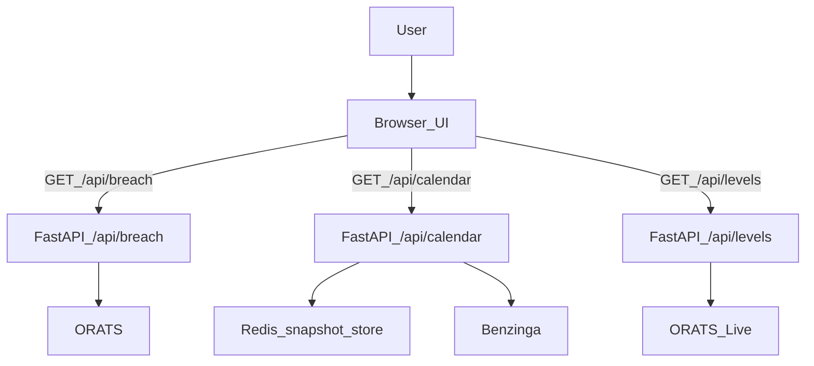

# Breach Algo — Desk‑First Risk Intelligence for Short Premium

This repo is a **risk-first trading system** for event-driven short premium.

It is not a “predict returns” app. It is a **decisioning stack** that answers:

- **Engine 1 (single name)**: “How often does this ticker’s earnings gap blow through implied, how bad is the tail when it breaches, and what is the safest wing geometry right now?”
- **Calendar**: “What’s the trading-week schedule for earnings + macro, and what’s the deterministic desk playbook around those events?”
- **Engine 2 (SPX)**: “Given regime/macro/seasonality, what weekly IC geometry is least dangerous — and where are the dealer‑gamma acceleration zones today?”

This README is intentionally long. It’s written to be credible to:

- A **trading desk** (how to use it; what is actionable; what is informational)
- An **investor** (market, moat, defensibility, operating model)
- An **engineer** (architecture, data contracts, caching, determinism, audit safety)

**Sanitized**: provider names and environment variable names are OK; no tokens, no host paths, no hostnames, no container names.

---

## Table of contents

- [Why this exists](#why-this-exists)
- [Product overview (what’s built)](#product-overview-whats-built)
- [How a desk uses it](#how-a-desk-uses-it)
- [Data sources and how we normalize them](#data-sources-and-how-we-normalize-them)
- [Core math and algorithms (with formulas)](#core-math-and-algorithms-with-formulas)
- [Dealer Gamma Map + Weekly Gamma Risk Heat-Map](#dealer-gamma-map--weekly-gamma-risk-heat-map)
- [System architecture](#system-architecture)
- [Caching model](#caching-model)
- [API reference](#api-reference)
- [Setup / run](#setup--run)
- [Deployment (sanitized)](#deployment-sanitized)
- [Limitations and risk disclosures](#limitations-and-risk-disclosures)
- [Supporting docs](#supporting-docs)
- [Roadmap](#roadmap)

---

## Why this exists

**The short-premium problem** isn’t finding entry signals — it’s surviving the tails.

Most tools tell you:

- “Implied move is X.”
- “IV is high/low.”
- “Skew is steep.”

Desks need something tighter:

1. **Event-aligned realized vs implied** over many cycles (earnings is a discontinuity, not a continuous process).
2. **Conditioning** that’s honest about sample sizes (quarter/regime/gate can collapse pools).
3. **Risk-first geometry guidance** that’s explainable and stable.
4. **Live structural context** (dealer gamma shelves / acceleration zones) separated from backtest stats.

This repo is built around one operating principle:

> Make every number auditable and every “model” legible enough to trade size against.

---

## Product overview (what’s built)

### Engine 1 — Earnings implied-move breach intelligence (single-name)

Engine 1 is the single-stock earnings core. It computes:

- **Breach stats** over the last \(n\) earnings events:
  - breach rate (at a configurable multiple \(k\))
  - “near breach” rates
  - overshoot severity conditional on breach
- **Quarter seasonality** (Q1–Q4) vs baseline behavior
- **Regime overlay** (risk climate label + tail multiplier + trade gate)
- **Wing recommendation** (Tail Asymmetry Score → asymmetric wing multipliers)
- **Trade Builder** (optional): strike-based IC suggestions from chain snapshots
- **Monte Carlo (additive, flag-gated)**: empirical earnings gap tail risk with determinism
- **Live gamma overlays (async)**:
  - Dealer Gamma Map (hover labels)
  - Weekly Gamma Risk Heat‑Map (slope + composite DTE weighting + stability)

### Calendar — Trading week dashboard (earnings + macro)

The calendar is the “desk view”:

- Month/week/day views
- Earnings tiles (from snapshot-backed data so the UI doesn’t fan out ORATS calls)
- Macro events (Benzinga economics) enriched with stable keys + playbook snippets
- Click-through into Engine 1 and macro event popovers with SPX reaction stats

### Engine 2 — SPX weekly IC risk engine

Engine 2 is a **weekly risk map** for SPX condors:

- Backtests weekly windows by a small set of widths and wings
- Computes breach/outside/MAE tail metrics
- Applies simple Bayesian smoothing for sparse bins (Beta-Binomial)
- Adds live dealer gamma and heatmap overlays (informational)
- Historical backtests prefer **SPX** daily bars; if unavailable from ORATS, the engine falls back to a **SPY proxy** for the backtest surface (explicitly labeled in notes).

---

## How a desk uses it

### Engine 1 workflow (single name)

1. Enter ticker (e.g. `AAPL`) and press **RUN**.
2. Read in order:
   - **Summary**: breach rate + overshoot (what’s the base tail?)
   - **Quarter seasonality**: is this quarter structurally worse?
   - **Regime overlay**: is the market/single-name stress environment elevated?
   - **Wing recommendation + Trade Builder**: where should wings go, symmetric or asymmetric?
   - **Live gamma visuals**: where are structural acceleration zones today?

Operating stance:

- Treat this as a **risk gate** and **geometry chooser**, not a predictor.
- If regime says **NO_TRADE**, you can still view suggested geometry — but you treat it as “reference only.”

### Calendar workflow

1. Use the month/week/day view to plan the trading week.
2. Click a ticker tile to deep-link into Engine 1.
3. Click macro events to open the macro popover:
   - deterministic desk playbook
   - SPX reaction stats (points and percent)

### Engine 2 workflow (SPX)

1. Run Engine 2 to compute the weekly IC risk grid.
2. Use the **Dealer Gamma Map** to see live walls/clusters/flip.
3. Use the **Weekly Gamma Risk Heat‑Map** (default composite+slope) to identify:
   - acceleration boundaries (where dealer hedging flips sign and remains)
   - distance-to-failure in points and in multiples of expected move
   - stability label: Stable / Asymmetric / Fragile (with reasons)

---

## Data sources and how we normalize them

### ORATS (primary market data)

Used for:

- Earnings history (`/hist/earnings`)
- Implied move anchoring (`impErnMv` from `/hist/cores`)
- EOD bars (`/hist/dailies`) for realized windows
- Chain snapshots (`/hist/strikes`) for strike-based trade building
- Live strikes (`/datav2/live/*`) for dealer gamma & heatmap overlays

**Critical**: tokens stay server-side (`ORATS_TOKEN` env var).

ORATS client caching (defaults from `backend/orats_client.py`):

- delayed endpoints cache TTL: **6 hours**
- live endpoints cache TTL: **10 seconds**

### Benzinga (macro calendar)

Used for:

- economics events (CPI/FOMC/NFP/etc)
- macro history used for reaction stats (best-effort)

### FMP (earnings calendar snapshot)

Used to build a stable upcoming earnings snapshot at scale.

Operational notes:

- The calendar reads a **Redis-backed snapshot** (it does not fan out live provider calls).
- Snapshot refresh script: `python3 scripts/refresh_fmp_calendar_snapshot.py --force`
  - Intended to run **daily after ~4:00am ET** (same “gate” as the legacy snapshot job).
  - Requires `REDIS_URL` and `FMP_API_KEY`.
- Snapshot TTL: `CALENDAR_EARNINGS_SNAPSHOT_TTL_S` (default **48h**). If the job doesn’t run and the key expires, `/api/calendar` will return **503** by default.
- Universe filter: `FMP_EARNINGS_UNIVERSE`
  - `sp500_nasdaq100` (default): filter to `data/universe/sp500.txt` + `data/universe/nasdaq100.txt`
  - `all`: keep all tickers returned by FMP (can be huge / noisy)
- Emergency rollback only: `CALENDAR_ALLOW_ORATS_EARNINGS_FALLBACK=1`
  - If enabled and FMP snapshot is missing, the app may fall back to the legacy ORATS snapshot.
  - **Symptom**: “earnings are mostly/all on Wednesdays” can occur because the ORATS fallback estimates `wksNextErn` and anchors imprecise “weeks-to-event” to the **Wednesday** of the projected week.

Fast diagnostics:

- `GET /api/calendar-snapshot-status` shows whether Redis has the FMP snapshot key, the last refresh ET date, rows used, and whether the legacy snapshot is present.

### Redis (required for Calendar)

The calendar endpoint is snapshot-backed and **requires** Redis (`REDIS_URL`). If Redis is unavailable, `/api/calendar` returns a 503.

Redis is used to store earnings snapshot data so the UI doesn’t fan out ORATS calls across thousands of tickers.

---

## Core math and algorithms (with formulas)

This section is designed to be audit-friendly.

### Earnings timing alignment (AMC/BMO)

Earnings are discontinuities. The tail lives in close→open.

We classify ORATS `anncTod` into:

- **AMC** (after close)
- **BMO** (before open)
- **UNK** (unknown)

Then the realized window is:

- AMC: close(earnDate) → open(next trading day)
- BMO: close(prior trading day) → open(earnDate)

### Implied move anchoring

For each event we attach:

- `pricingDateUsed`: the date used to price implied
- `impErnMv` and `impliedMovePct` from ORATS cores as-of that date

Because ORATS sometimes returns IV-like numbers as decimals vs percents, we normalize.

### Breach, ratio, overshoot

Let:

- \(I = \text{impliedMovePct}\)
- \(R = |\text{signedMovePct}|\) (absolute realized earnings gap percent)
- \(k\) = breach multiple (default 1.0)

Then:

- **Breach**: \(R > kI\)
- **Realized/Implied ratio**: \(\rho = R/I\)
- **Overshoot** (conditional on breach): \(\text{overshoot} = \frac{R-kI}{kI}\)

Why this is the right desk metric:

- “Breach rate” tells you frequency.
- “Overshoot” tells you severity when it fails (blown-out wings).

### Quarter seasonality

We compute per-quarter summary over the same usable event set and compare to baseline.

This yields deltas like:

- breach delta in percentage points
- ratio delta
- overshoot delta

Low-sample handling is explicit so small quarters don’t pretend to be precise.

### Regime overlay (risk climate)

Regime is computed as-of a date using only data ≤ that date (no lookahead).

Inputs (from `backend/regime_overlay.py`):

- SPY RV20 percentile
- ticker IV30 percentile
- SPY absolute 5D move percentile

Blend:

\[
\text{regimeScore} = 0.50\,MS + 0.35\,SN + 0.15\,CP
\]

\[
\text{tailMultiplier} = \text{clamp}(0.7, 2.0, 0.8 + 1.2\cdot\text{regimeScore})
\]

Then label and trade gate:

- Calm / Normal / Elevated / Stress
- OK / CAUTION / NO_TRADE

### Wing recommendation (Tail Asymmetry Score; TAS)

Engine 1 generates a deterministic TAS in \([-1,+1]\):

- negative → downside tail dominates
- positive → upside tail dominates

Components (from `backend/wing_recommendation.py`):

- directional breach-rate asymmetry
- overshoot asymmetry
- regime amplifier in Elevated/Stress

Then we transform TAS into asymmetric wing multipliers (widen the bad side, tighten the safe side).

### Trade Builder (strike-based IC construction)

When chain data exists (from `backend/trade_builder.py`):

- Pick expiration near a target DTE using `/hist/monies/implied`
- Pull strikes using `/hist/strikes`
- Choose shorts by equal-delta or equal-premium (auto-mode can follow wing recommendation)
- Choose longs by a fixed wing width (risk-defined)

If chain is missing, Trade Builder returns a safe stub with notes.

### Monte Carlo earnings gap risk (additive-only)

The MC system is designed to be audit-safe and deterministic. See `MC_AUDIT.md`.

Core variable (from `backend/mc_simulator.py`):

\[
S=\frac{\text{signedMovePct}}{\text{impliedMovePct}}
\]

We sample empirical shocks \(S\) (optionally conditioned) and evaluate IC intrinsic risk at open.

Determinism:

- stable seed derived from hashed inputs + a shock pool key
- cached results (TTL aligned with `/api/breach`)

---

## Dealer Gamma Map + Weekly Gamma Risk Heat‑Map

These are **live, informational overlays**. They are not used to change historical breach stats.

### Dealer Gamma Map

From ORATS live strikes we compute:

- OI walls and clusters
- gamma peaks
- a best-effort gamma flip strike proxy

The chart is rendered as a clean price-time overlay with hover-to-see labels.

### Weekly Gamma Risk Heat‑Map (v2)

We compute net dollar gamma per strike:

\[
\text{netDollarGex}(K)=\gamma(K)\cdot(OI_{call}(K)-OI_{put}(K))\cdot spot^2 \cdot 100
\]

Modes:

- **Net**: netDollarGex
- **Slope**: first difference across strikes \(\Delta(\text{netDollarGex})\), smoothed with a short rolling window

Ordering is explicit:

1) compute raw Net $GEX  
2) compute slope on raw Net $GEX  
3) normalize only for color scaling at render time using:

\[
\text{scaleDenom}=spot\cdot ATM\_IV
\]

Expiry weighting:

- default view is **composite buckets** (0–5 / 6–10 / 20–40 DTE) using exponential decay weighting by DTE

Acceleration boundaries:

- computed **only** on the **0–5 DTE composite row** and shown globally
- persistent boundary requires crossing and remaining on the new side for ≥ N adjacent strikes

Distance-to-failure:

- downside/upside distance in **points**
- also expressed as multiples of expected move (bucket-weighted effective DTE)

Weekly stability label (explicit priority):

1) Fragile if negative gamma exists within ±0.75 EM of spot  
2) Asymmetric if boundary distances differ by > 0.5 EM  
3) Stable otherwise  

Backend emits `reasons[]` strings exactly so the desk can audit why.

---

## System architecture

Backend: FastAPI (`backend/app.py`)  
Frontend: plain HTML/JS/CSS (`static/`)

High-level request flow:



Core routes:

- UI:
  - `GET /` (calendar)
  - `GET /breach` (Engine 1)
  - `GET /spx` (Engine 2)
- API:
  - `GET /api/breach`
  - `GET /api/calendar`
  - `GET /api/macro-event-stats` (SPY reaction stats)
  - `GET /api/levels` (generic per ticker dealer gamma + heatmap)
  - `GET /api/spx-ic` (Engine 2, feature-gated)
  - `GET /api/spx-levels` (Engine 2 live overlays, feature-gated)
  - `GET /api/condor-rank`

---

## Caching model

There are two caching layers:

1) **ORATS client caching** (`backend/orats_client.py`)
   - delayed endpoints: 6 hours
   - live endpoints: 10 seconds
2) **API response caching** (`backend/app.py`)

Current API TTLs (from `backend/app.py`):

| Cache | Purpose | TTL |
|---|---|---:|
| `_breach_cache` | Engine 1 earnings payload | 6h |
| `_condor_rank_cache` | Calendar rank helper | 6h |
| `_macro_stats_cache` | Macro reaction stats | 6h |
| `_calendar_cache` | Calendar payload | 10m |
| `_spx_ic_cache` | Engine 2 SPX IC payload | 30m |
| `_spx_levels_cache` | SPX live levels/heatmap | 60s |
| `_levels_cache` | Per-ticker live levels/heatmap | 60s |
| `_engine1_elig_cache` | Eligibility checks | 24h |

This split is intentional:

- Long TTL for expensive historical computations
- Short TTL for live overlays

---

## API reference

### Engine 1 — earnings breach

`GET /api/breach?ticker=XYZ&n=20&years=5&k=1.0`

Notable optional params (additive / optional):

- Trade Builder knobs: `mode`, `symmetry`, `target_delta`, `target_premium`, `wing_width`, `dte_target`, `exp`
- Monte Carlo toggles: `mc`, `mc_opt`, `mc_stability`, `mc_cond_quarter`, `mc_cond_regime`
- Manual next earnings override: `mc_event_date`, `mc_event_timing`

### Calendar

`GET /api/calendar?view=month|week|day&anchor=YYYY-MM-DD&tz=America/New_York&engine1Only=0|1&includeEvents=0|1&maxTickers=12000`

### Macro event stats (SPX)

`GET /api/macro-event-stats?key=CPI` (computed using SPY close-to-close)

### Live levels (per ticker; used by Engine 1)

`GET /api/levels?ticker=AAPL&view=weekly&include_heatmap=1&heatmap_view=composite&heatmap_mode=slope`

### Engine 2 SPX IC (feature gated)

`GET /api/spx-ic?entry_day=mon&seasonality_mode=quarter&risk_target_breach_pct=25`

Note: Engine 2 is intentionally **desk-locked** in compute (2y lookback, widths 1.0/1.5/2.0, 5pt wings). The API accepts additional parameters for compatibility, but the engine keeps the risk surface consistent by design.

---

## Setup / run

1) Create `.env` from `env.example`:

```bash
cp env.example .env
```

2) Install deps:

```bash
python3 -m venv .venv
source .venv/bin/activate
python -m pip install -r requirements.txt
```

3) Run:

```bash
source .venv/bin/activate
PORT=${PORT:-8000}
uvicorn backend.app:app --host 0.0.0.0 --port "$PORT" --reload
```

Open:

- `http://localhost:8000`

---

## Deployment (sanitized)

This app is designed to be exposed behind a reverse proxy with **gated access** so paid API keys cannot be abused.

Recommended production concepts:

- `INVITE_CODE` gate + signed cookies (`AUTH_SECRET`)
- reverse proxy + HTTPS
- rate limiting at the proxy layer
- scheduled snapshot refresh jobs (calendar)

---

## Limitations and risk disclosures

- This is a **risk engine**, not a guarantee of outcomes.
- Live gamma/GEX outputs are **best-effort** and depend on live data entitlements and chain completeness.
- Earnings realized window is **close→open** by design; intraday path is not modeled unless explicitly enabled.
- Small samples (quarter/regime conditioning) are handled conservatively to avoid false precision.

---

## Supporting docs

- `MC_AUDIT.md` — audit-safe Monte Carlo design, determinism, and no-lookahead requirements.

---

## Roadmap

High-value next steps that keep the system desk-credible:

- Explicit “confidence + sample size” badges on more panels
- Credit-aware structure optimization (only when credit is reliable and marked as such)
- More robust live-chain fallbacks and clearer entitlement diagnostics
- Exportable “trade ticket” summary for execution workflows

